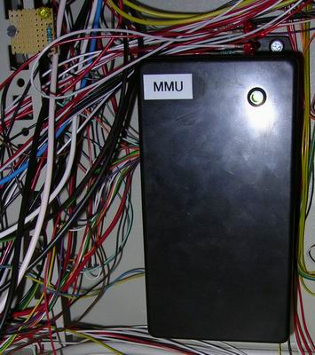

## Source code for project: [Power supply and fuse monitoring module](https://link.stdout.no/W)

Simple monitoring module for the essentials in the rack box project; power supplies, fuses and communication. Uses an AVR AT90S2313 microcontroller.

Written in basic, using [Bascom-AVR](http://www.mcselec.com/).

### Author
[Thomas Jensen](https://thomas.stdout.no)
